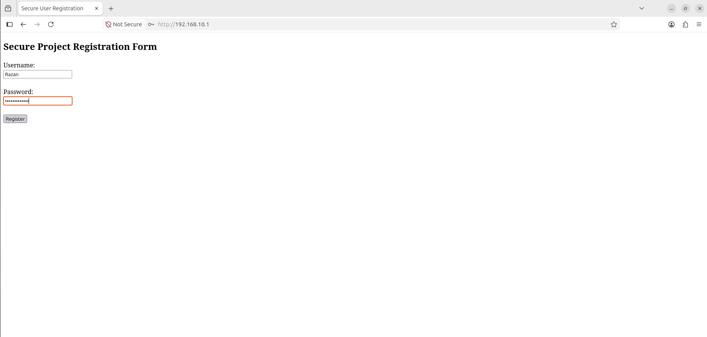
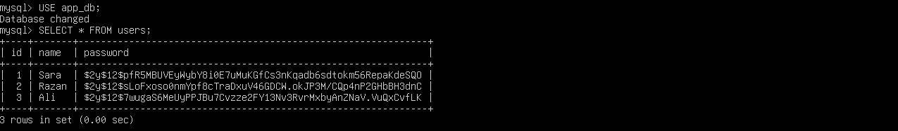
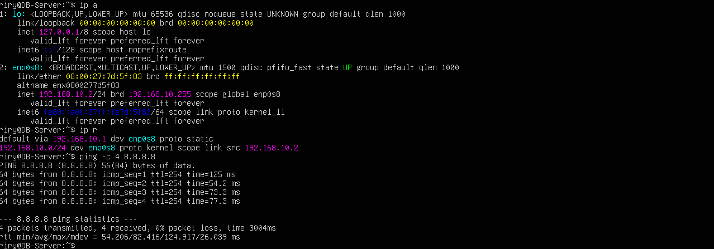
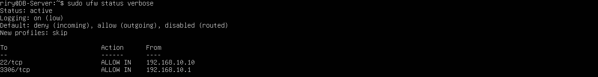

# Multi-Tier Linux Application Infrastructure

A Linux-based multi-tier application environment designed to demonstrate **server separation, network communication, security controls, and infrastructure management** using multiple virtual machines.

The project simulates a small enterprise/cloud environment where application and database workloads are deployed on separate Linux servers and communicate through an isolated internal network.

## 🚀 Project Overview

The environment consists of two Ubuntu-based server virtual machines and a desktop management VM:

* **Web Server:** Hosts Apache and a lightweight PHP application and acts as a network gateway for the Database Server.
* **Database Server:** Hosts MySQL and is isolated from the external network.
* **Ubuntu Desktop:** Used as the administration and remote management system.

The main focus of this project is **Linux infrastructure, networking, and security**, rather than application development. The PHP application is used only as a practical demonstration of communication between the application and database tiers.

### Key Highlights

* **Separated Infrastructure:** Web and database services run on independent Linux virtual machines.
* **Network Isolation:** The Database Server has only an internal network interface and no direct connection to the external network.
* **Gateway & NAT:** The Web Server provides internet access to the Database Server through IP forwarding and NAT when outbound connectivity is required.
* **Firewall Configuration:** UFW rules restrict incoming traffic to required services and trusted sources.
* **Access Control:** Database access is provided through a dedicated application account instead of the MySQL administrative account.
* **Cloud-Inspired Design:** The architecture demonstrates concepts commonly used in cloud environments such as workload separation, private networking, traffic control, and service isolation.

## 🏗️ System Architecture

```text
                         Internet
                            │
                         NAT NIC
                            │
                   ┌──────────────────┐
                   │    Web Server    │
                   │      Ubuntu      │
                   │ Apache + PHP     │
                   │ Gateway + NAT    │
                   │ IP Forwarding    │
                   │ 192.168.10.1     │
                   └────────┬─────────┘
                            │
                     Internal Network
                            │
                            ▼
                   ┌──────────────────┐
                   │ Database Server  │
                   │      Ubuntu      │
                   │      MySQL       │
                   │ 192.168.10.2     │
                   │ No Direct        │
                   │ Internet Access  │
                   └──────────────────┘
                            ▲
                            │ SSH
                            │
                   ┌──────────────────┐
                   │  Ubuntu Desktop  │
                   │  Management VM   │
                   └──────────────────┘
```

### Architecture Flow

1. A client sends an HTTP request to the Web Server.
2. Apache serves the PHP application.
3. The application communicates with the Database Server through the internal network.
4. MySQL processes database requests using a dedicated application account.
5. The Database Server does not have a direct external network interface.
6. When outbound internet access is required, traffic is forwarded through the Web Server acting as a gateway.
7. NAT on the Web Server translates the outbound traffic before it reaches the external network.
8. UFW firewall rules restrict incoming access to required services and trusted sources.

## ☁️ Cloud & Infrastructure Concepts

This project demonstrates several concepts that transfer directly to cloud environments:

* Virtualized server infrastructure
* Private/internal networking
* IP addressing
* Network segmentation
* Gateway configuration
* IP forwarding
* Network Address Translation (NAT)
* Firewall-based traffic control
* Workload separation
* Linux server administration
* Service management
* Access control
* Application-to-database communication
* Infrastructure isolation

The architecture is conceptually similar to deploying application and database workloads inside a private cloud network, where controlled routing and security policies determine how systems communicate.

## 🔒 Security & Access Control

Security is approached primarily from an infrastructure and network perspective.

* The Database Server has no direct NAT interface and is isolated from the external network.
* Outbound internet access from the Database Server is routed through the Web Server gateway when required.
* IP forwarding and NAT are configured on the Web Server to provide controlled outbound connectivity.
* UFW is configured with a **deny-by-default incoming policy**.
* Required inbound services are explicitly allowed through firewall rules.
* SSH access to the Database Server is restricted to the administration system.
* MySQL access is restricted to traffic originating from the Web Server.
* The application connects using a dedicated database account rather than the MySQL administrator account.
* Database privileges are scoped to the application database.
* Passwords are stored using PHP's password hashing mechanism rather than plain text.

## 📋 Prerequisites

* Two Ubuntu-based server virtual machines
* One Ubuntu Desktop management VM
* VirtualBox or another virtualization platform
* Internal network connectivity between the VMs
* Apache HTTP Server
* PHP
* MySQL Server
* Basic Linux networking and administration knowledge

## ⚙️ Deployment

### 1. Network & Web Server

The Web Server was configured with:

* An external/NAT network interface for internet connectivity.
* An internal network interface for communication with the Database Server.
* A static internal IP address.
* IP forwarding to route traffic between network interfaces.
* NAT rules to provide outbound internet access to the isolated Database Server.
* Apache and PHP for the application layer.
* UFW firewall rules to control incoming traffic.

### 2. Database Server

The Database Server was intentionally isolated from the external network.

It was configured with:

* A single internal network interface.
* A static internal IP address.
* MySQL Server.
* A dedicated application database and database user.
* Restricted firewall rules for inbound access.
* The Web Server configured as its default gateway.
* Outbound connectivity through the Web Server when internet access was required.

### 3. Network Configuration

The internal network connects the Web and Database Servers using private IP addresses.

The Web Server uses:

`192.168.10.1`

The Database Server uses:

`192.168.10.2`

The Database Server does not connect directly to the external network. Instead, its outbound traffic follows:

```text
Database Server
      ↓
Web Server Gateway
      ↓
NAT
      ↓
Internet
```

This provides internet connectivity when required while maintaining separation between the Database Server and the external network.

### 4. Firewall Configuration

UFW was configured to control inbound traffic.

The Database Server uses a **deny-by-default incoming policy**, with access explicitly allowed only for required services.

Examples include:

* SSH access from the authorized management system.
* MySQL access from the Web Server.
* Outbound connections allowed when required for system updates and package installation.

The Web Server also uses firewall rules to allow required services such as HTTP and SSH.

## 🧪 Deployment Verification

The environment was tested by:

* Verifying network connectivity between the servers.
* Confirming the Database Server had no direct external network interface.
* Verifying outbound internet connectivity through the Web Server gateway.
* Confirming IP forwarding and NAT functionality.
* Confirming UFW firewall rules were active.
* Confirming Apache was running on the Web Server.
* Accessing the application through the Web Server.
* Confirming successful communication between the application and MySQL.
* Registering a test user through the application.
* Verifying that the data was stored successfully in the Database Server.

## 📸 Project Evidence

### Web Application

Apache and the PHP application running successfully.


### Database

Application data successfully stored in MySQL on the isolated Database Server.


### Network Isolation & Routing

The Database Server uses the Web Server as its default gateway and successfully reaches the external network through the configured routing and NAT.


### Firewall

UFW firewall rules showing controlled inbound access to the required services.


## 🛠️ Technologies & Tools

* **Operating System:** Ubuntu Linux
* **Virtualization:** VirtualBox
* **Web Server:** Apache
* **Application Layer:** PHP
* **Database:** MySQL
* **Networking:** TCP/IP, Private IP Addressing, Internal Networking
* **Routing:** IP Forwarding, Gateway Configuration
* **NAT:** iptables
* **Firewall:** UFW
* **Administration:** Linux CLI, systemd, SSH

## 💡 Future Enhancements

The environment can be extended toward a more production-oriented cloud architecture by adding:

* Prepared SQL statements
* Environment variables for application credentials
* Automated deployment using Bash or Ansible
* HTTPS/TLS
* Docker containerization
* Reverse proxy and load balancing
* Centralized logging and monitoring
* More granular network segmentation
* Migration to cloud platforms such as AWS, Azure, or Google Cloud

## 🎯 Skills Demonstrated

* Linux server administration
* Virtual machine management
* Network configuration
* Private network design
* Network isolation
* Gateway configuration
* IP forwarding
* NAT configuration
* Firewall configuration with UFW
* Traffic control
* Server-to-server communication
* Apache deployment
* MySQL service administration
* Access control and permissions
* Troubleshooting network and service issues
* Understanding of multi-tier infrastructure
* Cloud-oriented infrastructure thinking

## 📚 What I Learned

This project strengthened my understanding of how multiple Linux servers can work together as an integrated infrastructure environment.

Instead of giving every server direct internet access, the Database Server was isolated on a private internal network and used the Web Server as a gateway when outbound connectivity was required.

Configuring IP forwarding, NAT, and firewall rules provided practical experience with how network traffic can be routed and controlled between different systems.

The project also demonstrated how separating application and database workloads improves **isolation, manageability, and security**, while providing a foundation for understanding similar architectures in cloud environments.

## 🌍 Real-World Relevance

The architecture reflects concepts commonly found in cloud infrastructure, where application and database workloads are separated within private networks and access is controlled through routing and security policies.

The project provides practical experience with concepts that map to cloud technologies such as **virtual networks, private subnets, routing, NAT gateways, security rules, virtual machines, and managed databases**.

## ✅ Result

Successfully deployed a two-tier Linux application environment across separate virtual machines with an isolated Database Server, controlled internal communication, gateway-based outbound connectivity, NAT routing, and firewall-based access control.

The environment demonstrates practical Linux and networking skills while applying cloud-oriented infrastructure and security principles.
